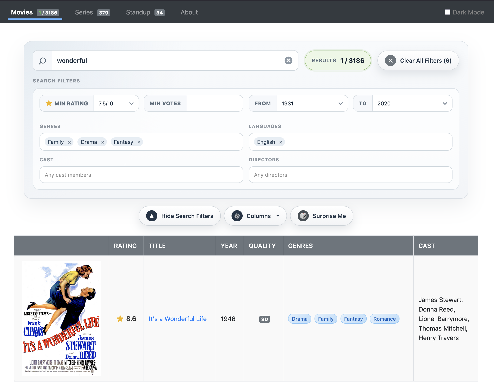
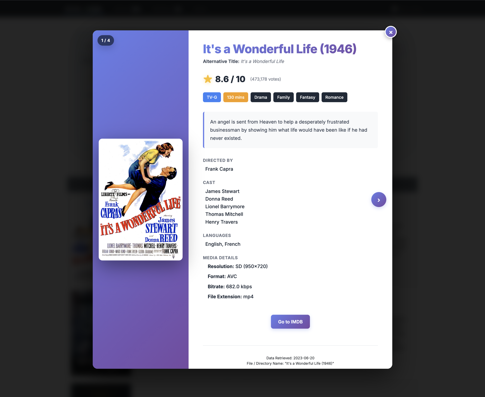

# Media Database

Media Database is a local media catalog for people who want direct control over how their collection is searched and browsed.

Most modern streaming platforms are optimized for TVs and recommendation feeds. That works well for passive viewing, but it is a poor fit for people who want to investigate a library in detail. These systems are built around algorithmic curation, limited search controls, and platform lock-in. They decide what to surface and make it harder to compare titles on your own terms.

Media Database takes the opposite approach. It is designed for computers, where dense tables, granular filters, sorting, and text search are practical and effective. The goal is to make your library easier to explore without relying on a platform’s recommendation engine or being tied to a single streaming ecosystem.

The project indexes locally stored media, enriches it with IMDb metadata, stores that data in local JSON files, and generates a static website for browsing movies, series, and standup.

## Why It Exists

- Browsing a large library is easier on a desktop than on a TV interface
- Detailed filters are more useful than recommendation-driven discovery
- Local data ownership keeps the catalog portable and independent
- Static output makes the workflow simple to run, share, and host

## What It Does

- Scans configured local directories for media files
- Fetches metadata from IMDb using the scraper configured in `conf.json`
- Persists normalized metadata to local JSON repositories in `_data/`
- Builds a static HTML site in `_output/`
- Supports browser-based filtering and sorting across many fields
- Supports movies, series, and standup
- Includes random selection from the current filtered result set
- Lets you customize visible columns in the list view
- Can play media directly in the browser when the format is supported

The table view is intentional. This project favors dense, searchable rows over poster-grid browsing.

## Interface

List view is the primary working surface: filter aggressively, sort results, and show only the columns you care about.



Each title also has a detail page for deeper browsing, and compatible files can be played directly in the browser.



## How It Works

1. Configure your media library paths in `conf.json`
2. Run the indexer
3. New titles are looked up on IMDb and stored in local JSON files
4. The site generator renders static pages from those saved JSON files
5. Open the generated site in a browser and use the filters there

Current saved data files:

- `_data/movie_data.json`
- `_data/series_data.json`
- `_data/standup_data.json`

Generated site output:

- `_output/index.html`
- `_output/series.html`
- `_output/standup.html`

## Quick Start

```bash
git clone https://github.com/at1as/Media-Database.git
cd Media-Database
make deps
make config
vim conf.json
make run
```

`make config` creates `conf.json` from [`conf.json.template`](conf.json.template) and refuses to overwrite an existing `conf.json`. Run it once, then edit the generated file with your local paths before starting the app.

To rebuild the static site from the existing saved JSON data without scraping new titles:

```bash
make dryrun
```

To open the generated site locally:

```bash
open _output/index.html
```

## Configuration

The project is configured through `conf.json`, which should be created from `conf.json.template` using `make config`.

If `conf.json` is missing, the app exits with a clear error telling you to copy the template first.

Top-level settings:

- `assets`: per-media-type settings for `movies`, `series`, and `standup`
- `exclude_files`: titles or directories to skip even if they match normal indexing rules
- `include_extensions`: allowed media extensions
- `file_override`: manual IMDb ID overrides for known mismatches
- `pause_time_sec`: delay between remote requests
- `imdb_source`: scraper implementation to use

Each entry in `assets` supports:

- `location`: absolute path to the media directory
- `saved_data`: path to the JSON repository for that media type
- `index_asset`: whether that media type should be scanned
- `max_assets`: cap on how many filesystem entries to inspect
- `max_assets_chunk`: cap on how many new items to process in a single run

## Running and Maintenance

Run the full pipeline:

```bash
make run
```

Run tests:

```bash
make test
```

Remove a bad saved entry so it can be re-scraped:

```bash
python3 scripts/remove_entry.py --movie "<movie_title>" "<YYYY>"
python3 scripts/remove_entry.py --series "<series_title>" "<YYYY>"
```

The year is optional. If omitted, the first matching entry is removed.

## Library Layout

Movies can be single files:

```text
Inception (2010).mp4
```

Or a directory containing the video file and related assets:

```text
Inception (2010)/
|-- Inception (2010).mp4
`-- Inception (2010).srt
```

Series should use a top-level directory named after the show and start year, with episodes inside child directories such as seasons:

```text
Firefly (2002)/
`-- Firefly Season 1
    |-- Firefly S01E01.mp4
    |-- Firefly S01E01.srt
    |-- Firefly S01E02 The Train Job.mp4
    `-- Firefly S01E02 The Train Job.srt
```

## Filtering Model

Filtering happens client-side on the rendered data, which keeps the browsing experience fast and makes it easy to combine structured and text-based refinement.

Common fields available for filtering or sorting include:

- title
- year
- rating
- genre
- languages
- cast
- director or creator
- running time

The browser UI also supports:

- random selection from the current filtered results
- customizable visible columns in list views
- direct playback on detail pages when the browser supports the media format

The interface is designed around precise control rather than recommendation feeds. It is built for users who already know something about what they want and want to narrow a large library quickly.

## Notes

- Metadata quality depends on IMDb lookup quality, scraper behavior, and local file naming
- The site is static output, so it can be opened directly from disk, hosted locally, or served on an internal network
- The project currently indexes movies, series, and standup
- Browser filtering is a core product decision, not a secondary feature

## Related Files

- `run.py`: entry point for normal and dry-run execution
- `src/worker.py`: indexing pipeline and JSON persistence
- `src/site_generator.py`: static HTML generation
- `src/scrapers/imdb_suggest.py`: current configured IMDb scraper
- `docs/llm_overview.md`: current architecture and filter behavior overview
